# SmartLeave — System Diagrams & Architectural Specifications

This document presents the complete, professionally labeled system diagrams for **SmartLeave (Smart Leave Approval Workflow System)**. Every diagram is modeled specifically after the SmartLeave architecture, database schema, AI NLP classification engine, multi-level approval pipeline, and role-based access control.

---

## 1. 🌊 Data Flow Diagrams (DFD)

### 1.1 Context Level DFD (Level 0)
The Context Diagram represents the overall SmartLeave system as a single central process interacting with three external entities: **Student / Employee**, **Faculty / Approver**, and **System Administrator**.

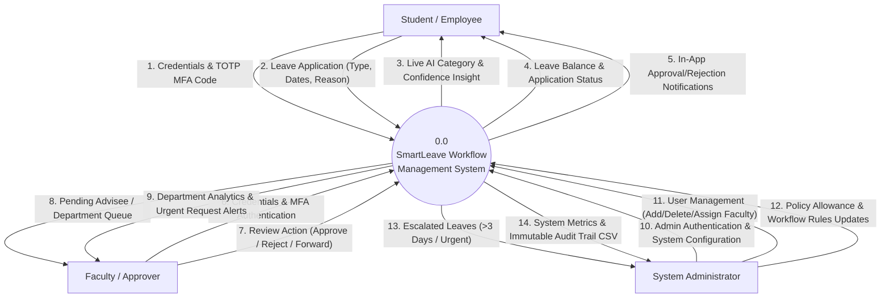

---

### 1.2 Level 1 DFD — Student / Employee Subsystem
Explodes the Student interactions into detailed sub-processes: Authentication, Leave Application with AI Reason Classification, Balance Tracking, and Notifications.

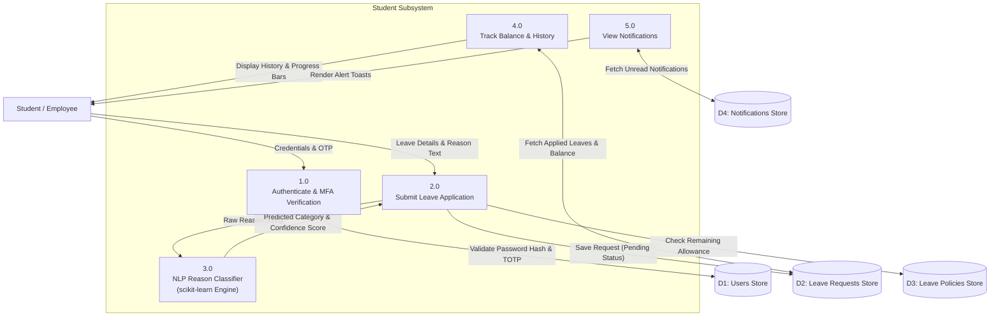

---

### 1.3 Level 1 DFD — Faculty / Approver Subsystem
Explodes the Faculty review operations: Pending Queue fetching, Approval Decision Processing, Notification Dispatching, and Department Statistics.

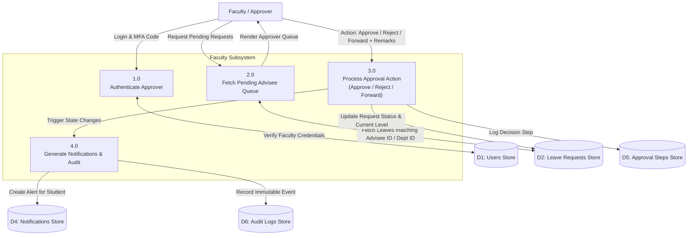

---

### 1.4 Level 1 DFD — Admin Subsystem
Models Administrative processes: System Control, User Account CRUD & 1-Faculty-to-Multiple-Students Assignment, Policy Configuration, Workflow Escalation, and Audit Trail.

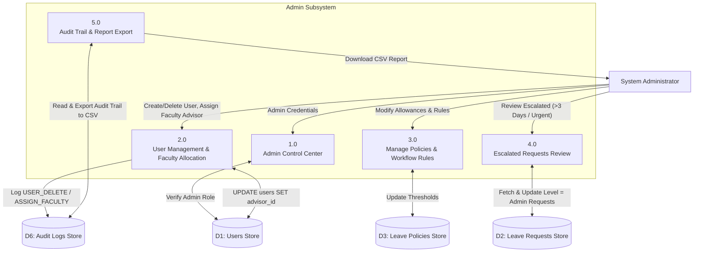

---

### 1.5 Level 2 DFD — Leave Approval & AI Classification Pipeline
Detailed Level 2 Data Flow Diagram illustrating the internal mechanics of Leave Submission, TF-IDF NLP Categorization, Escalation Engine, and Approval Pipeline.

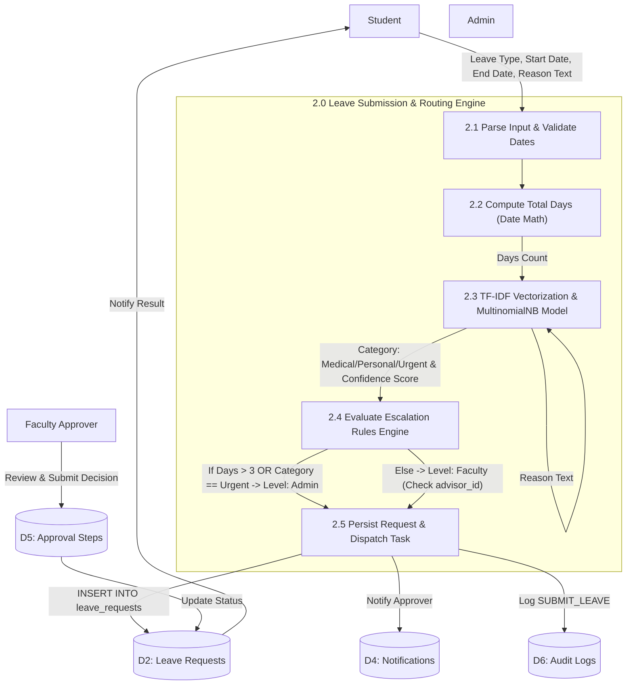

---

## 2. 👤 Use Case Diagrams

### 2.1 Complete System Use Case Overview
Provides a unified view of all system use cases grouped by actor roles.

```mermaid
flowchart LR
    subgraph Actors
        Student["👨‍🎓 Student / Employee"]
        Faculty["👨‍🏫 Faculty / Approver"]
        Admin["👨‍💼 Administrator"]
    end

    subgraph "SmartLeave Application Boundary"
        %% Shared Authentication
        UC_Login(("UC-1: Login & MFA Verification"))
        UC_Logout(("UC-2: Logout"))
        UC_Profile(("UC-3: View Profile"))

        %% Student Use Cases
        UC_Apply(("UC-4: Submit Leave Application"))
        UC_LiveAI(("UC-5: Live AI Reason Insight"))
        UC_TrackBal(("UC-6: View Leave Balance & History"))
        UC_ViewDetail(("UC-7: View Request Timeline"))
        UC_Notifs(("UC-8: Receive In-App Notifications"))

        %% Faculty Use Cases
        UC_Queue(("UC-9: View Advisee Pending Queue"))
        UC_Approve(("UC-10: Approve Leave Request"))
        UC_Reject(("UC-11: Reject Leave Request"))
        UC_Forward(("UC-12: Forward Request to Admin"))
        UC_FacultyStats(("UC-13: View Department Metrics"))

        %% Admin Use Cases
        UC_AdminDash(("UC-14: System Overview & Analytics"))
        UC_UserCRUD(("UC-15: Manage Users (Add/Edit/Delete)"))
        UC_AssignFac(("UC-16: Assign 1 Faculty to Multiple Students"))
        UC_ResetMFA(("UC-17: Reset User MFA Secrets"))
        UC_Policies(("UC-18: Manage Leave Policies"))
        UC_Workflow(("UC-19: Configure Workflow Rules"))
        UC_Audit(("UC-20: View & Export Audit Trail to CSV"))
    end

    %% Actor Associations
    Student --> UC_Login
    Student --> UC_Logout
    Student --> UC_Profile
    Student --> UC_Apply
    Student --> UC_LiveAI
    Student --> UC_TrackBal
    Student --> UC_ViewDetail
    Student --> UC_Notifs

    Faculty --> UC_Login
    Faculty --> UC_Logout
    Faculty --> UC_Profile
    Faculty --> UC_Queue
    Faculty --> UC_Approve
    Faculty --> UC_Reject
    Faculty --> UC_Forward
    Faculty --> UC_FacultyStats
    Faculty --> UC_Notifs

    Admin --> UC_Login
    Admin --> UC_Logout
    Admin --> UC_AdminDash
    Admin --> UC_UserCRUD
    Admin --> UC_AssignFac
    Admin --> UC_ResetMFA
    Admin --> UC_Policies
    Admin --> UC_Workflow
    Admin --> UC_Audit
```

---

## 3. 📐 Unified Class Diagram

Detailed UML Class Diagram illustrating object-oriented domain entities, services, relationships, attributes, and methods in the SmartLeave architecture.

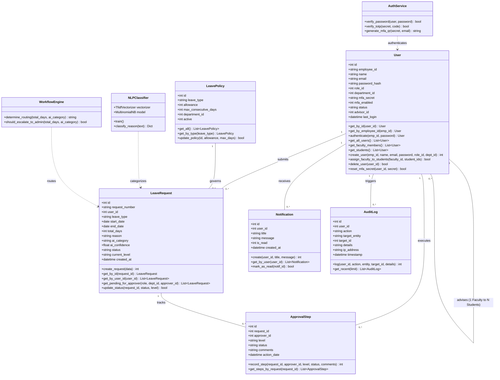

---

## 4. 🔄 Activity Diagrams

### 4.1 Student Activity Flow (Submit Leave & View Insight)

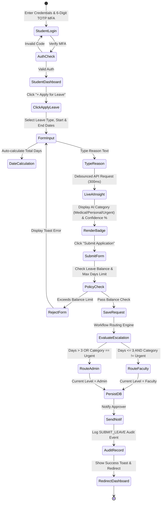

---

### 4.2 Faculty / Approver Activity Flow (Review & Process Requests)

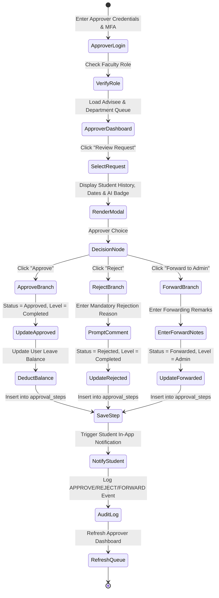

---

### 4.3 Admin Activity Flow (User CRUD & 1-Faculty-to-Multiple-Students Assignment)

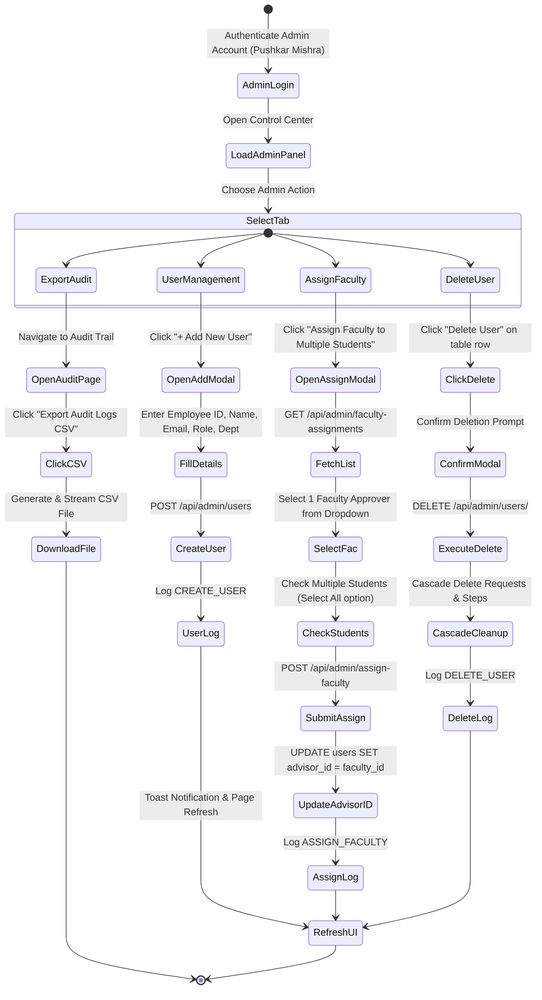

---

## 5. 🗄️ Entity-Relationship (ER) Diagram

Complete Relational Entity-Relationship Diagram representing the database schema for SmartLeave (`smartleave.db` / `database/schema.sql`).

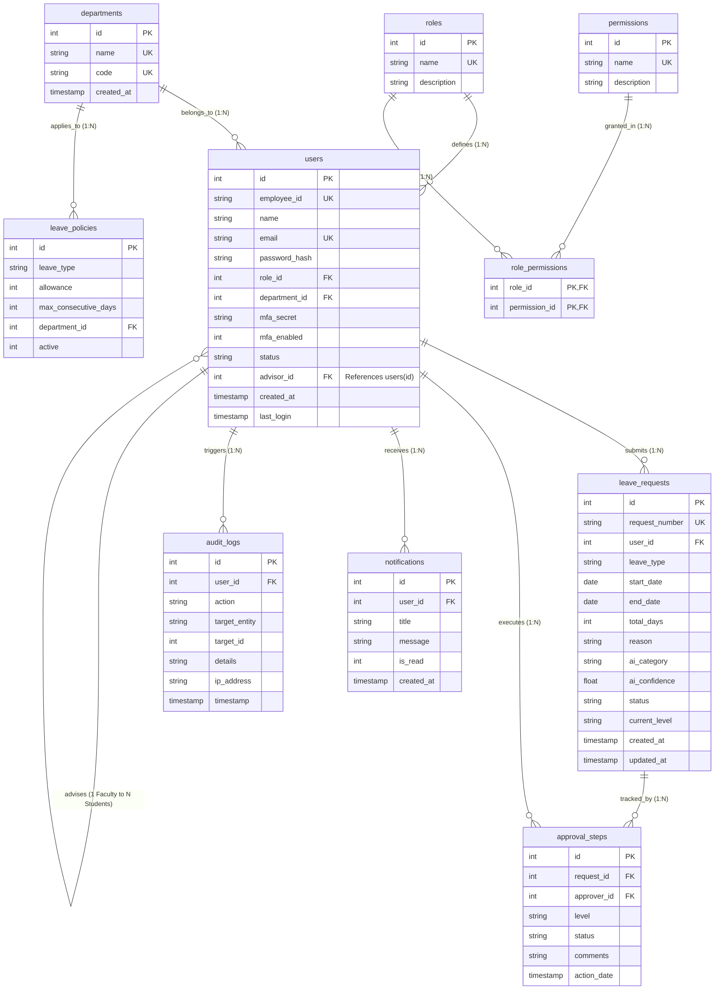

---

## 📋 Diagram Reference & Verification Summary

| Diagram | Description & Coverage | Format / Tool |
| :--- | :--- | :--- |
| **0.0 Context DFD** | High-level interactions between Student, Faculty, Admin, and SmartLeave. | Mermaid Flowchart |
| **1.1 Student DFD** | Subsystem operations: Auth, Apply, Live AI Classifier, Balance, Notifications. | Mermaid Flowchart |
| **1.2 Faculty DFD** | Subsystem operations: Auth, Advisee Queue, Approve/Reject/Forward, Audit. | Mermaid Flowchart |
| **1.3 Admin DFD** | Subsystem operations: Control Center, User CRUD, Assign Faculty, Policy, Audit. | Mermaid Flowchart |
| **2.0 Level 2 DFD** | Detailed submission, TF-IDF NLP classification, routing rules, and persistence. | Mermaid Flowchart |
| **Use Case Diagram** | Complete system boundary with Student, Faculty, and Admin use cases. | Mermaid Diagram |
| **Class Diagram** | UML class diagram showing domain models, services, attributes, and methods. | Mermaid Class Diagram |
| **Activity Diagrams** | Behavioral state diagrams for Student, Faculty, and Admin workflows. | Mermaid State Diagram |
| **ER Diagram** | Full relational database schema with PK/FK constraints and cardinality. | Mermaid ER Diagram |
